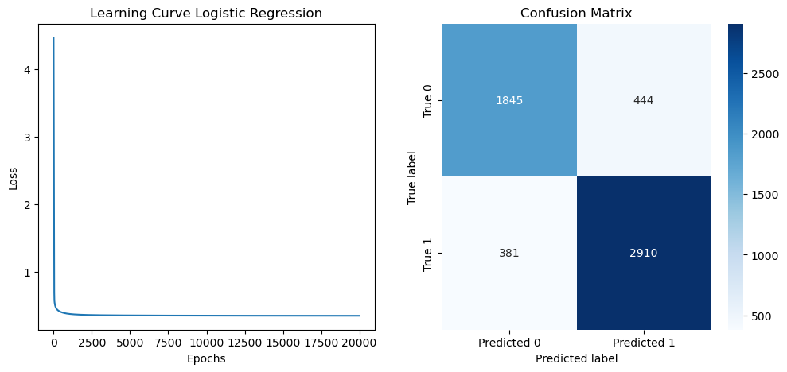
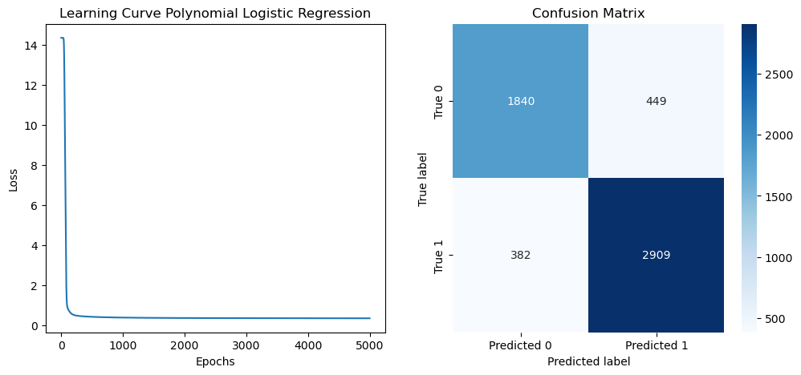

---

# **Student Depression Prediction: Logistic Regression From Scratch Using Gradient Descent**

## **Deskripsi Proyek**
Proyek ini bertujuan untuk memprediksi tingkat depresi pada siswa berdasarkan berbagai fitur. Fokus utama adalah membangun algoritma **dari awal (from scratch)** untuk memahami konsep fundamental **machine learning**, khususnya Logistic Regression.

**Fitur utama dari proyek ini:**
- Mengimplementasikan **fungsi biaya (loss function)** dan **gradient descent** secara manual menggunakan **NumPy**.
- Menggunakan **Polynomial Features** dari Scikit-learn untuk menambahkan elemen non-linear dalam model.
- Evaluasi model dilakukan menggunakan metrik seperti **Binary Cross-Entropy Loss** dan visualisasi **Confusion Matrix**.

---

## **Struktur Proyek**
```
├── notebook.ipynb        # Notebook utama berisi implementasi
├── dataset/              # Folder untuk menyimpan dataset
├── result/               # Folder untuk hasil visualisasi
├── requirements.txt      # Daftar pustaka Python yang diperlukan
└── README.md             # Dokumentasi proyek
```

---

## **Prasyarat**
- **Python**: Versi 3.8 atau lebih baru.
- **Jupyter Notebook** untuk menjalankan proyek.
- **Pustaka Python**: NumPy, Pandas, Scikit-learn, Matplotlib.

---

## **Langkah Menjalankan Proyek**

### 1. Clone Repository
Salin repository ini ke komputer lokal Anda:
```bash
git clone https://github.com/S4njuuu3291/binary-classifier-scratch
cd binary-classifier-scratch
```

### 2. Instalasi Dependensi
Buat virtual environment (opsional) dan instal pustaka yang diperlukan:
```bash
python -m venv env
source env/bin/activate  # Untuk Linux/MacOS
env\Scripts\activate     # Untuk Windows

pip install -r requirements.txt
```

### 3. Jalankan Notebook
Jalankan Jupyter Notebook untuk melihat implementasi:
```bash
jupyter notebook notebook.ipynb
```

---

## **Tentang Dataset**
Dataset **Student Depression** yang diambil dari [Student Depression Dataset](https://www.kaggle.com/datasets/hopesb/student-depression-dataset/) berisi data yang dirancang untuk menganalisis, memahami, dan memprediksi tingkat depresi di kalangan siswa. Dataset ini mencakup berbagai fitur yang relevan, seperti:

- **Informasi Demografis**: Usia, jenis kelamin, dan lokasi geografis.
- **Kinerja Akademik**: Nilai akademik (seperti CGPA), tingkat kehadiran, dan tekanan akademik.
- **Kebiasaan Gaya Hidup**: Pola tidur, aktivitas fisik, dan kegiatan sosial.
- **Riwayat Kesehatan Mental**: Informasi terkait kesehatan mental dan tanggapan terhadap skala depresi standar.
- **Kepuasan Hidup**: Kepuasan terhadap studi, pekerjaan, dan kehidupan secara umum.

**Beberapa Fitur Dataset:**
- **ID**: Identifikasi unik untuk setiap siswa.
- **Age**: Usia siswa.
- **Gender**: Jenis kelamin (Male/Female).
- **City**: Lokasi geografis tempat tinggal siswa.
- **CGPA**: Nilai rata-rata atau skor akademik lainnya.
- **Sleep Duration**: Rata-rata durasi tidur harian.
- **Depression**: Label biner yang menunjukkan status depresi siswa (Yes/No).

---

## **Hasil Proyek**

### **Visualisasi**
- **Learning Curve**: Menampilkan proses pelatihan untuk Logistic Regression, termasuk model dengan fitur Polynomial.
- **Confusion Matrix**: Membandingkan prediksi model dengan data aktual.

### **Evaluasi Model**
- Model dievaluasi menggunakan **Binary Cross-Entropy Loss** untuk mengukur performa selama pelatihan.
- **Confusion Matrix** digunakan untuk mengukur akurasi prediksi dan distribusi kesalahan model.

**Visualisasi Hasil:**

**Learning Curve** dan **Confusion Matrix**:





---

## **Teknologi yang Digunakan**
- **Python**: Bahasa utama untuk analisis dan pemodelan.
- **NumPy**: Untuk perhitungan numerik manual (gradient descent, loss function).
- **Pandas**: Untuk manipulasi dataset.
- **Matplotlib**: Untuk visualisasi hasil.
- **Scikit-learn**: Untuk pembentukan fitur polynomial dan evaluasi tambahan.

---

## **Kontak**
Proyek ini dibuat oleh **Sanjukin Pinem**. Jika Anda memiliki pertanyaan, saran, atau ingin berdiskusi lebih lanjut, jangan ragu untuk menghubungi saya:
- **LinkedIn**: [Sanjukin Pinem](https://www.linkedin.com/in/sanjukin-pinem-55bb45330/)
- **Email**: sanju329121@gmail.com

Kami juga membuka peluang kolaborasi! Silakan berkontribusi melalui pull request di [repository GitHub](https://github.com/S4njuuu3291/binary-classifier-scratch).

--- 